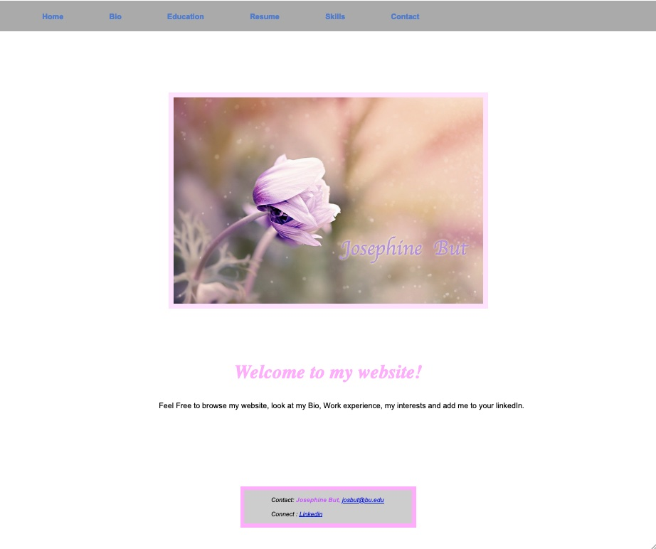
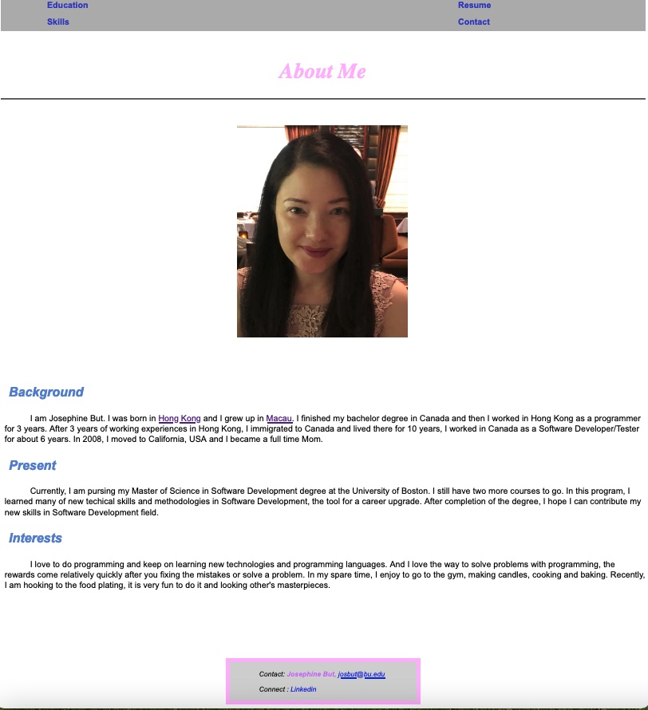
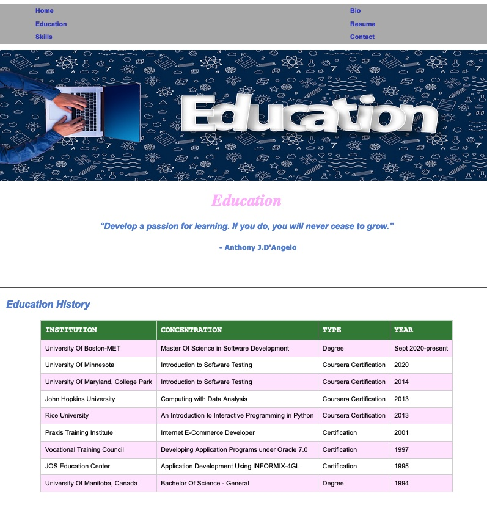
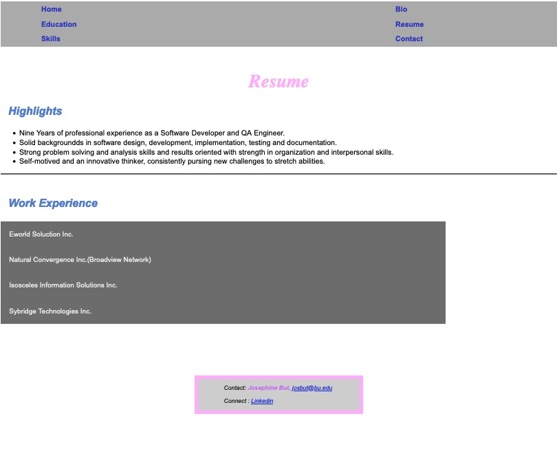
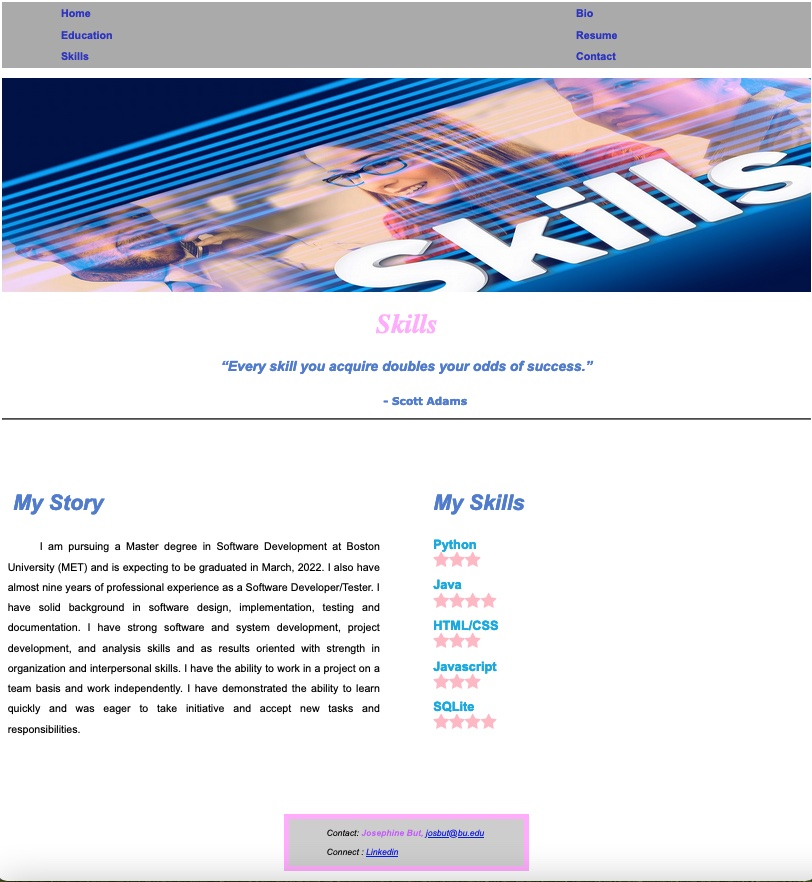
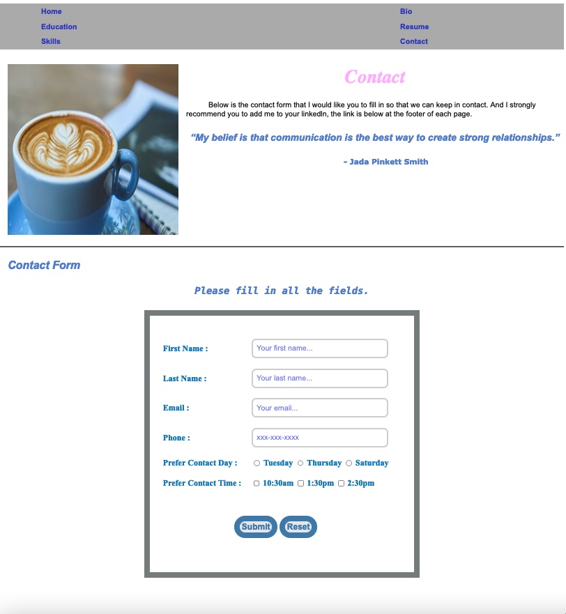

# METCS601_Project

Institution: [Boston University's Metropolitan College](https://www.bu.edu/met/) 
# METCS601 Project - My Portfolio

## Project Description:
In my project, I build a portfolio website using HTML5, CSS3, javascript and Vue.js. The portfolio summarize my biography,education, resume and skills. There is a contact form that the user can fill in and the form has input validation feature. It is a responsive website and the navigation bar, images, colors, font size will be changed based on different size of the screen. I use grid and flex and different CSS properties to do my layouts. And I added some ES6 to my javascripts and HTML pages.

 

# Web Pages Details
- Home Page

 
The home page is a welcome page. Navigation bar will be changed from horizontal to vertical when window size is getting smaller. Different navigation bar and pictures will be shown in different window size as well as colors, font style and font size.
 
Navigation bar component is created using Vue so it can be reused on each of the page. Data is stored in JSON file, use javascript to get the data from JSON file and process it and generate a navigation bar to the DOM.
 
- Bio Page
    
This is the biography page. It tells more about me, my background, my present and my interests. It has my photo on this page and the photo will change based on different size of the window.
 
- Education Page

Education page contains a table of my education history. The color of the rows will be changed when the user hover the pointer to the row. Data is stored in JSON file, use javascript to get the data from JSON file and process it and generate a education history table with heading.
 
- Resume Page

Resume page has a list of collapsible sections for my work experience. User can click on the section heading(the company name) to expand to see the detail of my work experience. Use HTML5 and CSS3 to develop this page.
 
- Skills Page

Skills page has my story and my skills sections. Two sections are displayed side by side using grid. Skills shows a list of skills with star ratings. Skills data is stored in JSON file, use javascript to get the data from JSON and process it and generate the skill with star rating. 
 
- Contact Page

Contact page is a page for the user to contact me. It includes a contact form for the user to fill in. Input form validation for each field is available. Error message will display to the DOM. Form cannot be submitted until all the fields are filled. Success page should be returned after submission.

## Requirement
- Need a browser 

Note : The website has been tested with Chrome, Safari and Firefox.

